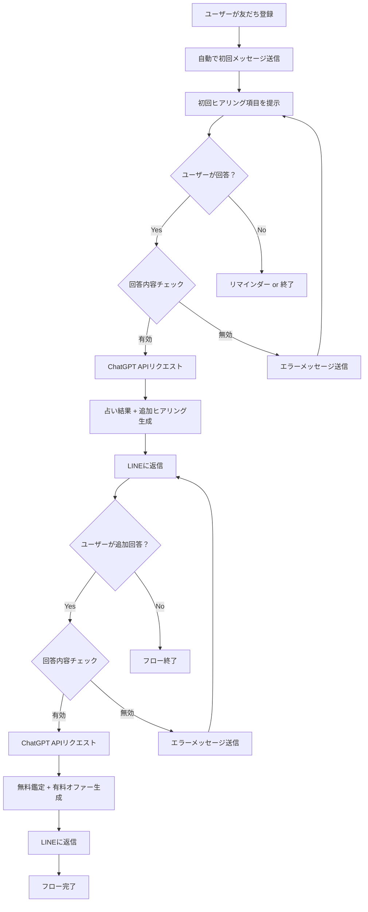

# 占いチャットボット（tsukasa）

LINE公式アカウントを活用した占いチャットボットシステム

## 概要

このプロジェクトは、LINE公式アカウントを通じて独自の占いサービスを提供するチャットボットです。
ユーザーの基本情報と悩みを聞き取り、ChatGPT APIを活用して占い結果を生成し、
最終的に有料サービスへの導線を提供します。

## 機能概要

### 基本フロー

1. **友だち登録トリガー**
   - ユーザーが公式アカウントを友だち登録
   - 自動で初回メッセージを送信（チャットボット以外から送信）

2. **初回ヒアリング**
   - お名前
   - 年齢と性別
   - 今気になっていること・悩んでいること
   - これからどうなっていきたいか・どんな将来を望んでいるか

3. **第1回占い結果生成**
   - ユーザーの回答をChatGPT APIに送信
   - 占い結果 + 追加ヒアリング項目を生成
   - LINEに返信

4. **詳細ヒアリング**
   - 追加質問に対するユーザーの詳細な回答を受信

5. **最終鑑定結果**
   - 全ての情報をChatGPT APIに送信
   - 無料鑑定結果 + 有料オファーを生成
   - LINEに返信してフロー完了

## 技術スタック

- **プラットフォーム**: Google Apps Script (GAS)
- **開発環境**: Clasp + Node.js (TypeScript)
- **LINE API**: LINE Messaging API
- **AI**: ChatGPT API (OpenAI)
- **データベース**: Googleスプレッドシート
- **ホスティング**: GAS（無料枠で運用）

## フローチャート



## 設計仕様

### 決定事項
- **データ保存**: ユーザーの回答内容や鑑定履歴をスプレッドシートに保存
- **初回メッセージ**: 友だち登録した瞬間に自動送信（チャットボット外部から）
- **占いの種類**: 独自の占い手法
- **プロンプト設計**: 実装時に詳細決定
- **有料オファー**: 実装時に詳細決定

### 必要な機能
- [ ] LINE Webhook受信
- [ ] ユーザー状態管理
- [ ] ChatGPT API連携
- [ ] メッセージ送信機能
- [ ] エラーハンドリング
- [ ] スプレッドシート連携

### 検討が必要な事項

#### エラーハンドリング詳細
**1. 入力形式エラー**
- 画像・スタンプ・動画が送信された場合の対応（要決定）
- 複数メッセージが一度に送信された場合の対応（要決定）
- 空メッセージの場合の対応（要決定）
- ChatGPT APIに送信する内容に必要な情報が不足している場合の対応（要決定）
- ChatGPT APIに送信する内容に不適切な情報が含まれている場合の対応（要決定）

**2. フロー状態エラー**
- 想定外のタイミングでメッセージが来た場合の対応（要決定）
- 途中で別の話題に変わった場合の対応（要決定）
- 長期間放置後の再開時の対応（要決定）

**3. API関連エラー**
- ChatGPT APIの制限・エラー時の対応（要決定）
- LINE APIのエラー時の対応（要決定）
- スプレッドシートの読み書きエラー時の対応（要決定）

**4. データ整合性エラー**
- ユーザー情報が見つからない場合の対応（要決定）
- セッション状態が不正な場合の対応（要決定）

**5. 回答内容チェック**
- 回答内容の有効性判定基準（要決定）
- メッセージ形式チェック（テキスト、画像、スタンプなど）（要決定）
- 内容の妥当性チェック（質問に対する適切な回答かどうか）（要決定）
- 文字数チェック（最低限の情報が含まれているか）（要決定）

#### その他の検討事項
- セッション管理の実装方法
- API制限への対応方法
- スプレッドシートのデータ構造設計

#### ユーザー状態管理
**必要な状態定義**
- INITIAL: 友だち登録直後、初回質問待ち
- WAITING_FIRST_ANSWER: 初回回答待ち
- WAITING_ADDITIONAL_ANSWER: 追加回答待ち
- COMPLETED: フロー完了
- ERROR: エラー状態

**状態管理の課題**
- フロー完了後にメッセージが来た場合の対応（要決定）
- 一度完了したユーザーが再度利用する場合の対応（要決定）
- 最初の回答と追加回答とフロー完了後メッセージの見分け方法

**スプレッドシート設計案**
```
userId | status | lastMessage | createdAt | updatedAt
```

## 開発予定

1. プロジェクト構成の決定
2. Clasp環境構築
3. LINE Bot基盤の構築
4. スプレッドシート連携
5. ChatGPT API連携
6. フロー実装
7. エラーハンドリング実装
8. テスト・デプロイ

## セットアップ

### Git Hooks設定

Git Hooksを有効にするために、以下のコマンドを実行してください：

```bash
git config core.hooksPath .githook
```

これにより、`.githook`ディレクトリ内のスクリプトがGit Hooksとして使用されます。